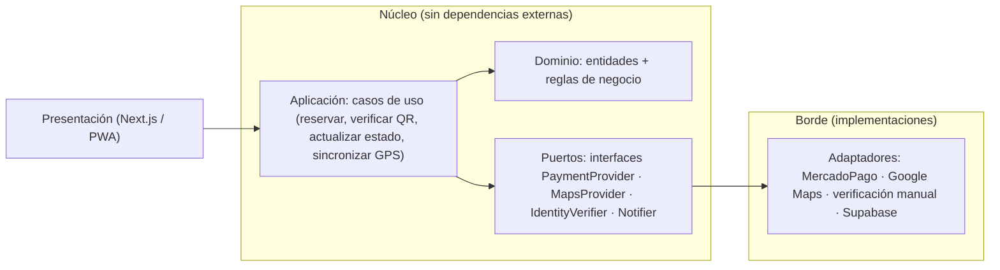
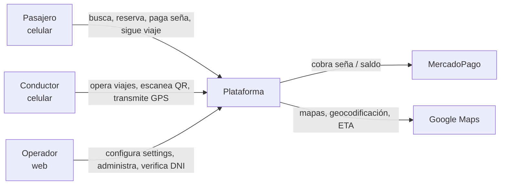
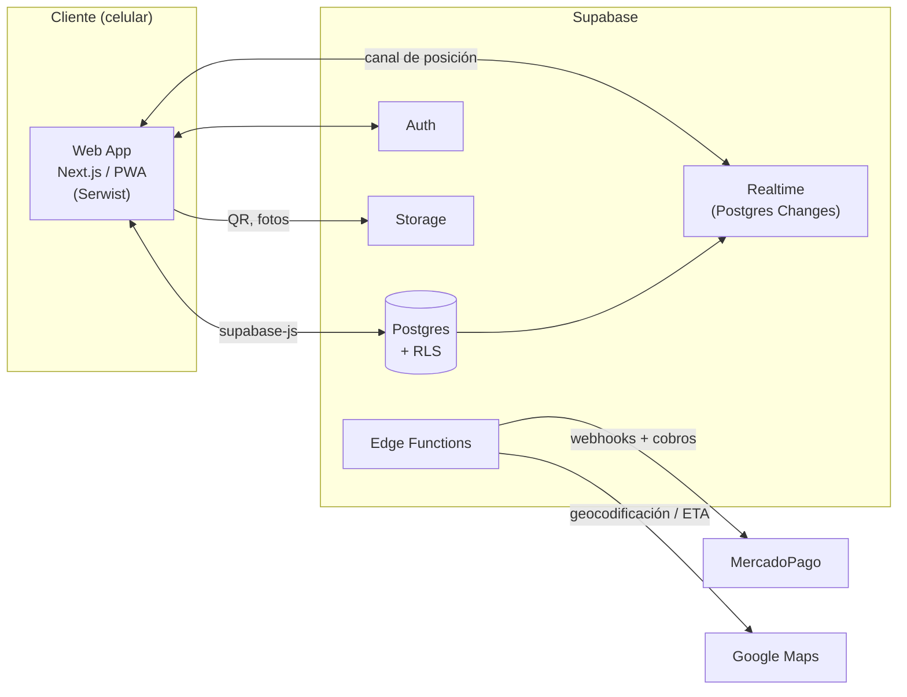
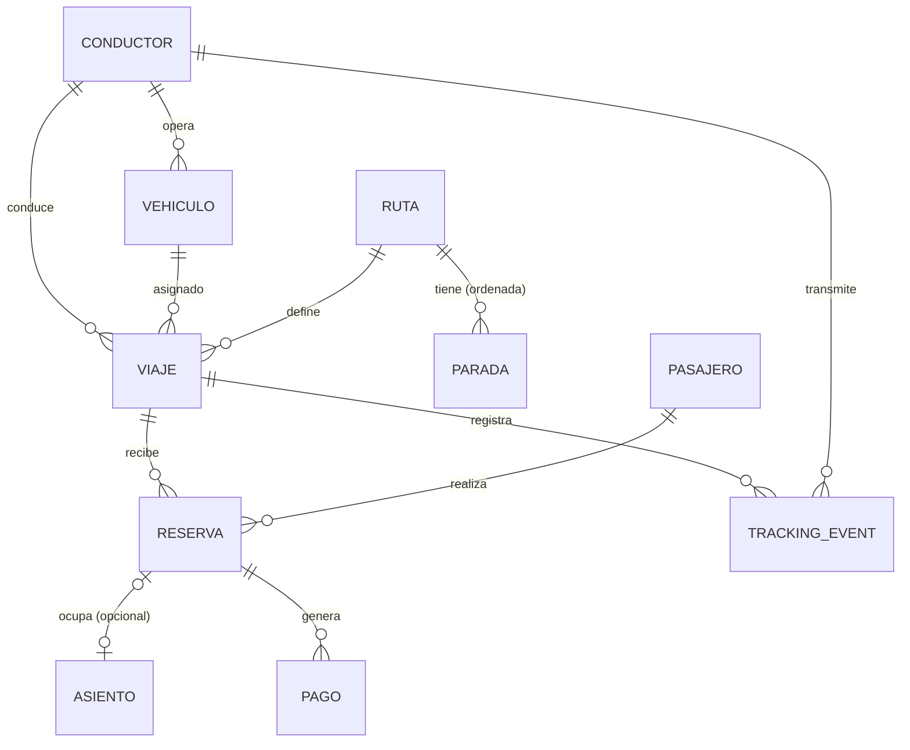

# Arquitectura — Plataforma de Viajes Compartidos Interurbanos

**Producto:** plataforma de viajes compartidos interurbanos (tramo principal Tandil ↔ Buenos Aires).
**Documento:** 02-arquitectura.md · Arquitectura de solución (spine).
**Estado:** borrador para revisión.
**Formato:** sigue el "architecture spine" de BMAD: decisiones como invariantes (AD), shape en diagramas, lo estructural como seed, lo que no se decide acá va a *Deferred*.

---

## Resumen ejecutivo (para el equipo no técnico)

- **Una sola codebase web** (Next.js + PWA), mobile-first. No apps nativas separadas.
- **Supabase** como base de datos, login, tiempo real y archivos. Todo lo de negocio se configura en una tabla, sin tocar código.
- **GPS en vivo** con una cola offline para los tramos sin señal. En el MVP el conductor mantiene la pantalla encendida; el tracking con pantalla apagada se habilita después con una capa nativa liviana (Capacitor) sobre el **mismo** código.
- **Pagos, mapas e identidad** van detrás de interfaces, para poder cambiar de proveedor sin reescribir la lógica.

---

## Paradigma de diseño

**Monolito modular por capas, con puertos y adaptadores (ports & adapters) para los proveedores externos.**

Un solo deploy (no microservicios) dividido en módulos por dominio, con una regla de dependencia estricta: **el núcleo (dominio + aplicación) no depende de ningún framework ni proveedor externo**; los proveedores (MercadoPago, Google Maps, verificación de identidad, Supabase) entran solo por **puertos** (interfaces) implementados por **adaptadores**.



| Capa | Qué contiene | Depende de |
|---|---|---|
| Presentación | Páginas y componentes React (Next.js) | Aplicación |
| Aplicación | Casos de uso / flujos de negocio | Dominio + Puertos |
| Dominio | Entidades (viaje, reserva, pago, tracking) y reglas puras | nada externo |
| Puertos | Interfaces de proveedores y repositorios | — |
| Adaptadores | Implementaciones concretas de puertos | infraestructura |
| Infraestructura | Supabase (Postgres, Auth, Realtime, Storage), APIs externas | — |

---

## Decisiones de arquitectura (invariantes)

Cada decisión: **Binds** (qué gobierna), **Prevents** (qué divergencia evita), **Rule** (la regla ejecutable). `[ADOPTED]` = ya cerrado por el PRD.

### AD-1 — Paradigma y regla de dependencia

- **Binds:** todo el código.
- **Prevents:** lógica de negocio acoplada a un framework o proveedor; que dos módulos construyan una misma entidad de forma incompatible.
- **Rule:** el dominio no importa nada externo (ni React, ni `@supabase/supabase-js`, ni SDKs de pagos/mapas). Los proveedores se invocan solo a través de puertos. Las dependencias apuntan siempre hacia adentro (presentación → aplicación → dominio/puertos).

### AD-2 — Entrega única web `[ADOPTED]`

- **Binds:** frontend, entrega.
- **Prevents:** mantener apps nativas iOS/Android separadas y duplicar lógica.
- **Rule:** una sola codebase web (Next.js) instalable como PWA. No se crean apps nativas separadas.

### AD-3 — Tracking GPS: primer plano en MVP, background vía Capacitor después

- **Binds:** captura de posición del conductor (NFR-01, NFR-02).
- **Prevents:** decidir tarde entre web/app y bloquear el requisito de background; o prometer "GPS con pantalla apagada" en web pura, que los navegadores no permiten.
- **Rule:** en el MVP el tracking es **en primer plano** (conductor con la pantalla encendida mientras conduce), siempre con **cola offline**. El tracking real en background (pantalla apagada/bloqueada) se habilita post-MVP con un wrapper **Capacitor** + plugin nativo de geolocalización en background, reutilizando la misma web. Es una decisión explícita: *web pura no puede trackear en background*.

### AD-4 — Datos, auth y realtime en Supabase

- **Binds:** persistencia, autenticación, tiempo real, archivos.
- **Prevents:** dispersar la lógica de acceso a datos y la autorización; auth hecha a mano; canales de tiempo real ad-hoc.
- **Rule:** todo el estado persistente vive en **Supabase (Postgres)**. El acceso se gobierna con **Row Level Security (RLS)** — la autorización se define a nivel de base, no solo en el cliente. Auth con Supabase Auth. La URL y credenciales de Supabase viven en `.env` (infraestructura configurable, no hardcodeada).

### AD-5 — Configuración en dos capas `[ADOPTED]`

- **Binds:** todo el código.
- **Prevents:** hardcodear valores de negocio (obliga redeploy para cambiar una tarifa); o meter secretos en la base.
- **Rule:** secretos e infraestructura → `.env` (nunca se commitea). Parámetros de negocio (tarifa, comisión, seña, espera, devoluciones, feature flags) → tabla `settings` en DB, editables por el operador sin redeploy. El runtime lee settings de DB con una caché corta; el dominio expresa las reglas en función de esos settings, nunca de constantes.

### AD-6 — Posición en vivo vía Postgres Changes sobre `tracking_events`

- **Binds:** seguimiento en vivo (FR-14) y trazabilidad.
- **Prevents:** dos fuentes de verdad (un canal efímero para "ver en vivo" + otra tabla para "historial") que pueden divergir; polling.
- **Rule:** el conductor escribe cada posición en la tabla `tracking_events`; los pasajeros se suscriben a los **cambios de esa tabla** (Supabase Realtime / Postgres Changes). Una sola vía de escritura = historial y vivo unificados.

### AD-7 — Cola offline en IndexedDB

- **Binds:** captura de posición sin cobertura (NFR-01).
- **Prevents:** perder posiciones en tramos sin señal; reordenar eventos al sincronizar.
- **Rule:** el dispositivo del conductor encola cada posición (lat, lng, timestamp, precisión) en **IndexedDB**. Al recuperar conectividad (`online`), hace flush **ordenado por timestamp** hacia la API/DB. La cola no descarta eventos sin confirmación de escritura.

### AD-8 — Pagos detrás de `PaymentProvider` `[ADOPTED]`

- **Binds:** seña, saldo, devoluciones (FR-05, FR-08, FR-17).
- **Prevents:** acoplar la lógica de reserva/devolución al SDK de una pasarela.
- **Rule:** el dominio solo conoce `PaymentProvider` (crear intención de seña, confirmar pago vía webhook, devolver seña). MercadoPago es el adaptador MVP. La confirmación de pago es **server-side** (webhook), nunca se confía en el cliente.

### AD-9 — Mapas detrás de `MapsProvider` `[ADOPTED]`

- **Binds:** render de mapa, geocodificación de paradas, ETA (FR-14, FR-23).
- **Prevents:** acoplar el frontend a la API de un proveedor de mapas.
- **Rule:** todo acceso a mapas pasa por `MapsProvider` (Google Maps es el adaptador MVP). Clave de API en `.env`.

### AD-10 — Identidad detrás de `IdentityVerifier` `[ADOPTED]`

- **Binds:** verificación del pasajero (FR-20).
- **Prevents:** acoplar el alta de pasajeros a un proveedor de verificación.
- **Rule:** el dominio consulta `IdentityVerifier`. Fase 1 = **manual** (el operador marca verificado desde el panel). La API de verificación (RENAPER u otro) entra después como otro adaptador, sin tocar el dominio.

### AD-11 — QR de reserva como token opaco, validación server-side

- **Binds:** identificación del pasajero al subir (FR-06, FR-07).
- **Prevents:** QR falsificables o que expongan datos personales; validación confiable solo en el cliente.
- **Rule:** el QR codifica un **token opaco** de reserva (no el DNI ni datos personales). Al escanear, la verificación se hace **server-side** contra la reserva y valida reserva ↔ viaje ↔ conductor ↔ vehículo. Un QR de otro viaje se rechaza.

### AD-12 — Máquina de estados de viaje y reserva como invariante central

- **Binds:** viajes y reservas (FR-11, FR-17, RN-06).
- **Prevents:** estados inventados por módulo; transiciones inválidas; pérdida de trazabilidad.
- **Rule:** viaje: `programado → recogida → en curso → completado` / `cancelado`. Reserva: `pendiente_seña → confirmada → verificada → abordada` / `cancelada` / `no_show`. Toda transición es explícita, validada y **logueada con timestamp y actor** (auditoría).

### AD-13 — Privacidad del DNI

- **Binds:** acceso a datos personales (NFR-04).
- **Prevents:** exponer el DNI a quien no lo necesita; filtrar datos por error.
- **Rule:** el DNI se almacena cifrado y con acceso mínimo. El conductor **no ve el DNI completo**: para verificar le alcanza nombre + estado de la reserva + QR. RLS restringe la lectura del DNI solo al rol operador/verificación. Cumple Ley 25.326.

### AD-14 — Monorepo con workspaces

- **Binds:** estructura del repositorio.
- **Prevents:** repos separados que desincronizan tipos y lógica de dominio compartida.
- **Rule:** un monorepo (workspaces de npm/bun) con `apps/web`, `supabase/` (migraciones y funciones) y `packages/` (tipos y dominio compartidos). Paquete manager: **npm** (Node 22 ya instalado; bun es alternativa compatible si se instala).

---

## Convenciones de consistencia

| Aspecto | Convención |
|---|---|
| Naming de entidades/tablas | snake_case en DB (`tracking_events`, `settings`); camelCase en TS; nombres en singular para tablas |
| IDs | UUID (generados por Supabase) |
| Fechas | timestamps ISO 8601 UTC |
| Errores | envelope único `{ error: { code, message } }`; códigos estables de negocio (ej. `RESERVA_SIN_ASIENTOS`, `QR_INVALIDO`) |
| Config | nunca constantes de negocio en código; siempre settings (AD-5) |
| Estado | transiciones solo vía la máquina de estados (AD-12) |
| Auth/RLS | toda query con RLS; roles `pasajero` / `conductor` / `operador` |

---

## Stack (seed — versiones verificadas al 2026-08-18)

Las versiones exactas las fija el lockfile en la implementación; acá se fijan las elecciones.

| Componente | Elección | Notas |
|---|---|---|
| Lenguaje | TypeScript | tipado de extremo a extremo |
| Frontend | **Next.js 16** (App Router) | mobile-first, SSR opcional, API routes como BFF |
| UI | React 19 + Tailwind CSS 4 + shadcn/ui | consistente con el stack que ya usás en Tumo |
| PWA | **Serwist** (`@serwist/next`) | instalable + offline (cache de shell) |
| Base de datos | **Supabase (Postgres)** + RLS | Auth, Realtime, Storage, Edge Functions incluidas |
| SDK | `@supabase/supabase-js` 2.x | cliente del frontend |
| Pagos | MercadoPago (adaptador) | SDK `mercadopago` 3.x en Edge Function |
| Mapas | Google Maps (adaptador) | clave en `.env` |
| Validación | Zod | schemas de entrada/contratos |
| Package manager | npm (Node 22) | bun como alternativa si se instala |

---

## Seed estructural

### Vista de contexto (nivel 1)



### Vista de contenedores (nivel 2)



### Modelo de datos núcleo (relaciones)



### Árbol de código (mínimo)

```text
tubi/
  apps/
    web/                # Next.js (App Router) + PWA + shadcn
      src/
        app/            # rutas y páginas
        features/       # módulos por dominio: viajes, reservas, pagos, tracking, settings
          <modulo>/
            domain/     # entidades + reglas (sin deps externas)
            application/# casos de uso
            ports/      # interfaces de proveedores
            adapters/   # implementaciones (MercadoPago, Google Maps, supabase)
        lib/            # cliente supabase, settings cache, qr, auth
  supabase/
    migrations/         # schema SQL (tablas, RLS, enums de estado)
    functions/          # Edge Functions (pagos, webhooks)
  packages/
    shared/             # tipos y dominio compartidos (si hace falta)
  docs/                 # 00-roadmap, 01-prd, 02-arquitectura, ...
```

---

## Mapa capacidad → arquitectura

Puente entre los requisitos del PRD y dónde viven.

| Capacidad / área | Vive en | Gobernada por |
|---|---|---|
| Búsqueda y reserva (FR-01/04) | `features/viajes`, `features/reservas` | AD-1, AD-5, AD-12 |
| Pago de seña y saldo (FR-05/08) | `features/pagos` → `PaymentProvider` | AD-8 |
| QR y verificación (FR-06/07) | `features/reservas` (token + validación server) | AD-11, AD-13 |
| Estados del viaje (FR-11) | `features/viajes/domain` (máquina de estados) | AD-12 |
| Recogida y espera (FR-12/13) | `features/viajes/application` | AD-5 (tiempo de espera en settings) |
| Seguimiento en vivo (FR-14) | `features/tracking` → `tracking_events` + Realtime | AD-6, AD-7 |
| Settings (FR-16) | `features/settings` + tabla `settings` | AD-5 |
| Cancelación/devolución (FR-17) | `features/reservas` + `PaymentProvider` | AD-8, AD-12 |
| Reporte de incidentes (FR-19) | `features/viajes` | AD-12 |
| Verificación de identidad (FR-20) | `IdentityVerifier` (manual fase 1) | AD-10 |

---

## Deferred (decisiones que este doc no toma)

- **Hosting/producción** (Vercel vs Cloudflare vs self-host, dominio) → fase 10.
- **Método de auth** (email+password vs OTP por SMS, que tiene costo) → implementación; default email+password.
- **Mecánica fina de MercadoPago** (Checkout Pro vs Wallet) → al implementar pagos.
- **Retención/poda de `tracking_events`** (cada cuánto se archiva) → cuando haya volumen.
- **Ratings/reputación** → fase 2, feature flag ya contemplado.
- **Tarifa por kilómetro** → fuera del MVP.
- **Plugins exactos de Capacitor** para GPS en background → post-MVP, cuando se encare el tracking con pantalla apagada.
- **Bun vs npm** → npm por ahora (Node 22 instalado); bun es drop-in si se quiere velocidad.
