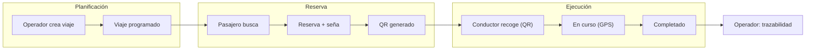
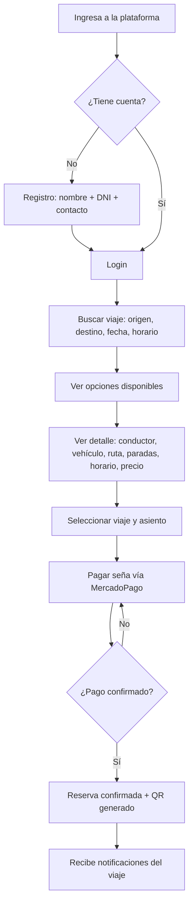
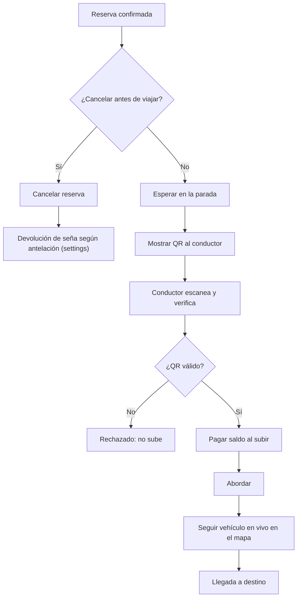
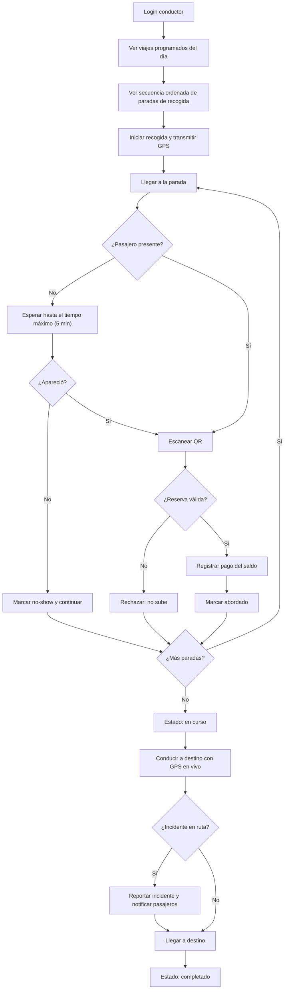
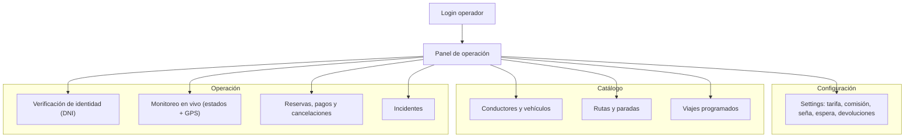

# Flujos de Usuario — Plataforma de Viajes Compartidos Interurbanos

**Producto:** plataforma de viajes compartidos interurbanos (tramo principal Tandil ↔ Buenos Aires).
**Documento:** 03-flujos-de-usuario.md · Diagramas de flujo por actor.
**Rol:** puente entre la arquitectura (`02-arquitectura.md`) y los wireframes (fase 6): cada flujo define las pantallas que habrá que dibujar en Pencil.

Los estados que aparecen en los flujos son los de **AD-12** (máquina de estados de viaje y reserva). Los valores de negocio (seña, espera, devoluciones) salen de **settings** (AD-5), nunca hardcodeados.

---

## 1. Ciclo de vida del viaje (los tres actores convergen)

---

## 2. Flujo del pasajero

### 2.1 Registro, búsqueda y reserva

### 2.2 Subida al vehículo, seguimiento y cancelación

---

## 3. Flujo del conductor

---

## 4. Flujo del operador

---

## 5. Mapa flujo → pantallas (alimenta los wireframes de Pencil)

Cada fila es una pantalla que habrá que wireframear en la fase 6. Todas mobile-first (375px); las del operador son web responsive.

| Actor | Pantalla | Flujo que cubre |
|---|---|---|
| Pasajero | Búsqueda de viajes | origen, destino, fecha, horario |
| Pasajero | Resultados de búsqueda | opciones disponibles |
| Pasajero | Detalle de viaje | conductor, vehículo, ruta, paradas, horario, precio |
| Pasajero | Checkout de seña | pago MercadoPago |
| Pasajero | Confirmación + QR | reserva confirmada, QR para mostrar |
| Pasajero | Mis reservas / historial | listado, cancelación |
| Pasajero | Seguimiento en vivo | mapa, posición, ETA |
| Conductor | Viajes del día | viajes programados |
| Conductor | Recogida / navegación | secuencia de paradas ordenadas |
| Conductor | Escaneo de QR | verificación de reserva |
| Conductor | Abordado / saldo | registrar pago, marcar abordado |
| Conductor | En ruta | GPS, estados, reportar incidente |
| Operador | Dashboard | viajes del día, estados, tracking |
| Operador | Gestión | conductores, vehículos, rutas, paradas |
| Operador | Settings | parámetros de negocio |
| Operador | Verificación de identidad | DNI manual fase 1 |

---

## Notas para la fase de wireframes

- Los flujos asumen la **web app mobile-first**: una sola columna, acciones primarias al alcance del pulgar.
- El **QR** y el **escáner** son los dos momentos críticos de verificación (pasajero muestra / conductor escanea); ambos deben quedar en pantallas de alta legibilidad (poco texto, alto contraste).
- El **seguimiento en vivo** es una pantalla "pasiva" para el pasajero (no requiere interacción, solo ver).
- La **política de espera y no-show** (5 min) debe comunicarse con claridad visual en la pantalla de recogida del conductor.
