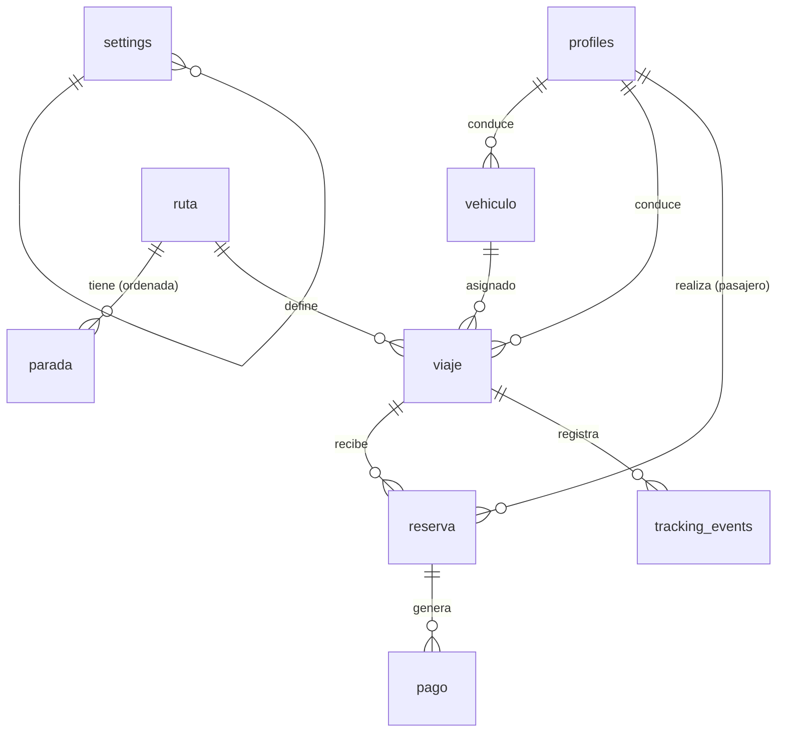

# Modelo de Datos — Plataforma de Viajes Compartidos Interurbanos

**Producto:** plataforma de viajes compartidos interurbanos (tramo principal Tandil ↔ Buenos Aires).
**Documento:** 04-modelo-de-datos.md · Schema de base de datos (Supabase / Postgres).
**Rol:** formaliza las entidades del PRD (`01-prd.md`) en tablas reales, siguiendo la arquitectura (`02-arquitectura.md`): RLS para autorización (AD-4), settings en DB (AD-5), `tracking_events` como fuente única de posición (AD-6), cola offline idempotente (AD-7), QR como token opaco (AD-11), privacidad del DNI (AD-13).

---

## Convenciones

- **Naming:** snake_case. Tablas de dominio en **singular** (`vehiculo`, `ruta`, `parada`, `viaje`, `reserva`, `pago`); nombres Supabase-idiomáticos en plural (`profiles`, `settings`, `tracking_events`).
- **PKs:** `uuid` (via `gen_random_uuid()`), excepto `tracking_events` que usa `bigint identity` por volumen de escritura.
- **Timestamps:** `timestamptz` (UTC). `created_at`/`updated_at` en tablas mutables.
- **Auth:** los usuarios viven en `auth.users` (Supabase Auth); `profiles` extiende con rol y datos de dominio.
- **Enums** para estados y tipos (nunca strings sueltos).
- **RLS** activado en todas las tablas: la autorización se define a nivel de base (AD-4).

---

## Esquema conceptual (ERD)



> **Nota de modelado:** `pasajero` y `conductor` son **roles** de `profiles`, no tablas separadas (una persona puede ser ambos; ver *Decisiones*). `asiento` no es tabla: en el MVP la capacidad vive en `vehiculo.capacidad` y la ocupación se calcula contando reservas activas del viaje.

---

## Enums

```sql
create type rol             as enum ('pasajero', 'conductor', 'operador');
create type estado_viaje    as enum ('programado', 'recogida', 'en_curso', 'completado', 'cancelado');
create type estado_reserva  as enum ('pendiente_sena', 'confirmada', 'verificada', 'abordada', 'cancelada', 'no_show');
create type tipo_pago       as enum ('sena', 'saldo');
create type metodo_pago     as enum ('efectivo', 'transferencia');
create type estado_pago     as enum ('pendiente', 'confirmado', 'rechazado');
create type tipo_parada     as enum ('origen', 'intermedio', 'destino');
```

Estados alineados con la máquina de estados de AD-12.

---

## Tablas

### `profiles` — usuarios y roles

| Columna | Tipo | Notas |
|---|---|---|
| `id` | uuid PK | referencia `auth.users(id)` |
| `rol` | `rol` | pasajero / conductor / operador |
| `nombre` | text | |
| `apellido` | text | |
| `telefono` | text | |
| `dni` | text nullable | **cifrado** (pgcrypto); solo pasajeros (AD-13) |
| `dni_verificado` | boolean default false | marcado por el operador (fase 1 manual) |
| `created_at` / `updated_at` | timestamptz | |

### `vehiculo`

| Columna | Tipo | Notas |
|---|---|---|
| `id` | uuid PK | |
| `conductor_id` | uuid FK → profiles | responsable del vehículo |
| `patente` | text **unique** | |
| `marca` / `modelo` / `color` | text | |
| `capacidad` | int, `check (capacidad > 0)` | |

### `ruta`

| Columna | Tipo | Notas |
|---|---|---|
| `id` | uuid PK | |
| `nombre` | text | |
| `origen` / `destino` | text | Tandil ↔ Buenos Aires |

### `parada`

| Columna | Tipo | Notas |
|---|---|---|
| `id` | uuid PK | |
| `ruta_id` | uuid FK → ruta, on delete cascade | |
| `nombre` / `ciudad` | text | |
| `lat` / `lng` | numeric | coordenadas |
| `orden` | int | secuencia dentro de la ruta |
| `tipo` | `tipo_parada` | origen / intermedio / destino |
| | | `unique (ruta_id, orden)` |

### `viaje`

| Columna | Tipo | Notas |
|---|---|---|
| `id` | uuid PK | |
| `ruta_id` | uuid FK → ruta | |
| `conductor_id` | uuid FK → profiles | |
| `vehiculo_id` | uuid FK → vehiculo | |
| `fecha_salida` | timestamptz | horario de salida |
| `eta_llegada` | timestamptz nullable | llegada estimada |
| `precio` | numeric | **snapshot** del setting al crearse (AD-5) |
| `estado` | `estado_viaje` | default `programado` |
| `created_at` / `updated_at` | timestamptz | |

### `reserva`

| Columna | Tipo | Notas |
|---|---|---|
| `id` | uuid PK | |
| `viaje_id` | uuid FK → viaje | |
| `pasajero_id` | uuid FK → profiles | |
| `asiento_num` | int nullable | posición 1..capacidad (opcional en MVP) |
| `estado` | `estado_reserva` | default `pendiente_sena` |
| `monto_sena` | numeric | snapshot del setting |
| `qr_token` | text **unique** | token opaco del QR (AD-11), sin datos personales |
| `politica_cancelacion` | jsonb | snapshot de la política aplicada |
| `cancelada_en` | timestamptz nullable | |
| `created_at` / `updated_at` | timestamptz | |

### `pago`

| Columna | Tipo | Notas |
|---|---|---|
| `id` | uuid PK | |
| `reserva_id` | uuid FK → reserva | |
| `tipo` | `tipo_pago` | sena / saldo |
| `monto` | numeric | |
| `metodo` | `metodo_pago` | efectivo / transferencia |
| `estado` | `estado_pago` | pendiente / confirmado / rechazado |
| `comprobante` | text nullable | referencia/URL del comprobante (transferencia) |
| `confirmado_por` | uuid FK → profiles nullable | quién confirmó (operador o conductor) |
| `created_at` | timestamptz | |

### `tracking_events` — posición del vehículo (AD-6 / AD-7)

| Columna | Tipo | Notas |
|---|---|---|
| `id` | bigint identity PK | |
| `client_id` | uuid | **idempotencia**: generado en el dispositivo; `unique` |
| `viaje_id` | uuid FK → viaje | |
| `lat` / `lng` | numeric | |
| `precision_m` | numeric nullable | |
| `ts` | timestamptz | timestamp **del dispositivo** (no `now()`) |
| `sincronizado` | boolean default false | marca el flush de la cola offline |
| `created_at` | timestamptz | |

`unique (client_id)` permite re-sincronizar la cola offline sin duplicar eventos (AD-7).

### `settings` — parámetros de negocio (AD-5)

| Columna | Tipo | Notas |
|---|---|---|
| `clave` | text **PK** | ej. `reserva.sena_monto` |
| `valor` | jsonb | tipado (número, texto, bool, array) |
| `tipo` | text | metadato de validación (`number`/`text`/`boolean`/`json`) |
| `descripcion` | text | |
| `actualizado_por` | uuid FK → profiles nullable | |
| `updated_at` | timestamptz | |

---

## Índices

```sql
create index on viaje (estado);
create index on viaje (fecha_salida);
create index on viaje (ruta_id);
create index on reserva (viaje_id);
create index on reserva (pasajero_id);
create index on tracking_events (viaje_id, ts);
create index on parada (ruta_id, orden);
create index on pago (reserva_id);
```

---

## Seguridad (RLS) — AD-4 / AD-13

RLS activado en todas las tablas. Resumen de políticas:

| Tabla | SELECT | INSERT | UPDATE | DELETE |
|---|---|---|---|---|
| `profiles` | dueño + operador | — (vía signup) | dueño; operador marca `dni_verificado` | operador |
| `vehiculo` | autenticados | operador | operador / conductor dueño | operador |
| `ruta` / `parada` | autenticados | operador | operador | operador |
| `viaje` | autenticados | operador | operador / conductor del viaje (estado) | operador |
| `reserva` | dueño + conductor del viaje + operador | pasajero | operador (confirmar seña) · conductor (verificar/abordar) | operador |
| `pago` | dueño + operador | pasajero (seña) · conductor (saldo) | operador (confirmar) | operador |
| `tracking_events` | pasajeros del viaje + operador | conductor del viaje | — | — |
| `settings` | autenticados | operador | operador | operador |

**Privacidad del DNI (AD-13):** `profiles.dni` se guarda **cifrado** (pgcrypto, clave en Vault). El conductor **no puede leerlo**: el acceso a la columna `dni` se restringe por RLS a dueño + operador. Para verificación, el conductor solo ve `nombre` + estado de la reserva + QR.

---

## Seeds de `settings` (defaults de arranque)

```sql
insert into settings (clave, valor, tipo) values
  ('tarifa.precio_base_tandil_bsas', '0',                            'number'),  -- a definir por el operador
  ('tarifa.modelo',                   '"fijo_por_ruta"',             'text'),
  ('comision.plataforma_pct',         '15',                          'number'),
  ('reserva.sena_monto',              '5000',                        'number'),
  ('reserva.espera_max_min',          '5',                           'number'),
  ('reserva.devolucion_24h_pct',      '100',                         'number'),
  ('reserva.devolucion_12_24h_pct',   '50',                          'number'),
  ('reserva.devolucion_menos_12h_pct','0',                           'number'),
  ('pagos.metodos',                   '["efectivo","transferencia"]','json'),
  ('verificacion.dni_modo',           '"manual"',                    'text'),
  ('feature.ratings_habilitado',      'false',                       'boolean');
```

---

## Migración SQL (referencia — va a `supabase/migrations/`)

```sql
-- 0001_init.sql
create extension if not exists pgcrypto;

create type rol            as enum ('pasajero', 'conductor', 'operador');
create type estado_viaje   as enum ('programado', 'recogida', 'en_curso', 'completado', 'cancelado');
create type estado_reserva as enum ('pendiente_sena', 'confirmada', 'verificada', 'abordada', 'cancelada', 'no_show');
create type tipo_pago      as enum ('sena', 'saldo');
create type metodo_pago    as enum ('efectivo', 'transferencia');
create type estado_pago    as enum ('pendiente', 'confirmado', 'rechazado');
create type tipo_parada    as enum ('origen', 'intermedio', 'destino');

create table profiles (
  id uuid primary key references auth.users(id) on delete cascade,
  rol rol not null default 'pasajero',
  nombre text not null,
  apellido text not null,
  telefono text not null,
  dni text,
  dni_verificado boolean not null default false,
  created_at timestamptz not null default now(),
  updated_at timestamptz not null default now()
);

create table vehiculo (
  id uuid primary key default gen_random_uuid(),
  conductor_id uuid not null references profiles(id),
  patente text not null unique,
  marca text not null,
  modelo text not null,
  color text not null,
  capacidad int not null check (capacidad > 0),
  created_at timestamptz not null default now()
);

create table ruta (
  id uuid primary key default gen_random_uuid(),
  nombre text not null,
  origen text not null,
  destino text not null,
  created_at timestamptz not null default now()
);

create table parada (
  id uuid primary key default gen_random_uuid(),
  ruta_id uuid not null references ruta(id) on delete cascade,
  nombre text not null,
  ciudad text not null,
  lat numeric not null,
  lng numeric not null,
  orden int not null,
  tipo tipo_parada not null default 'intermedio',
  unique (ruta_id, orden)
);

create table viaje (
  id uuid primary key default gen_random_uuid(),
  ruta_id uuid not null references ruta(id),
  conductor_id uuid not null references profiles(id),
  vehiculo_id uuid not null references vehiculo(id),
  fecha_salida timestamptz not null,
  eta_llegada timestamptz,
  precio numeric not null,
  estado estado_viaje not null default 'programado',
  created_at timestamptz not null default now(),
  updated_at timestamptz not null default now()
);

create table reserva (
  id uuid primary key default gen_random_uuid(),
  viaje_id uuid not null references viaje(id),
  pasajero_id uuid not null references profiles(id),
  asiento_num int,
  estado estado_reserva not null default 'pendiente_sena',
  monto_sena numeric not null,
  qr_token text not null unique,
  politica_cancelacion jsonb not null,
  cancelada_en timestamptz,
  created_at timestamptz not null default now(),
  updated_at timestamptz not null default now()
);

create table pago (
  id uuid primary key default gen_random_uuid(),
  reserva_id uuid not null references reserva(id),
  tipo tipo_pago not null,
  monto numeric not null,
  metodo metodo_pago not null,
  estado estado_pago not null default 'pendiente',
  comprobante text,
  confirmado_por uuid references profiles(id),
  created_at timestamptz not null default now()
);

create table tracking_events (
  id bigint generated always as identity primary key,
  client_id uuid not null,
  viaje_id uuid not null references viaje(id),
  lat numeric not null,
  lng numeric not null,
  precision_m numeric,
  ts timestamptz not null,
  sincronizado boolean not null default false,
  created_at timestamptz not null default now(),
  unique (client_id)
);

create table settings (
  clave text primary key,
  valor jsonb not null,
  tipo text not null default 'text',
  descripcion text,
  actualizado_por uuid references profiles(id),
  updated_at timestamptz not null default now()
);

create index on viaje (estado);
create index on viaje (fecha_salida);
create index on viaje (ruta_id);
create index on reserva (viaje_id);
create index on reserva (pasajero_id);
create index on tracking_events (viaje_id, ts);
create index on parada (ruta_id, orden);
create index on pago (reserva_id);

-- RLS: activar en todas las tablas y crear políticas por rol (ver sección Seguridad).
alter table profiles enable row level security;
alter table vehiculo enable row level security;
alter table ruta enable row level security;
alter table parada enable row level security;
alter table viaje enable row level security;
alter table reserva enable row level security;
alter table pago enable row level security;
alter table tracking_events enable row level security;
alter table settings enable row level security;
```

> Las políticas RLS concretas se escriben en la fase de implementación (necesitan funciones helper de rol); este doc fija la **matriz de permisos** que las políticas deben cumplir.

---

## Decisiones y trade-offs

- **`profiles` único con `rol`** en vez de tablas `pasajero`/`conductor` separadas: una persona puede ser ambos (el operador también puede conducir). Si el modelo crece, se parte después.
- **Sin tabla `asiento`:** en el MVP la capacidad es `vehiculo.capacidad` y la ocupación se valida contando reservas activas. `asiento_num` en reserva es opcional (posición concreta si hace falta).
- **Snapshots (`viaje.precio`, `reserva.monto_sena`, `reserva.politica_cancelacion`):** se copian del setting al crearse, para que los viajes/reservas históricos conserven el valor con el que se pactaron aunque el operador cambie el setting después.
- **`tracking_events.client_id` único:** idempotencia para re-sincronizar la cola offline sin duplicar (AD-7). `ts` es el timestamp del dispositivo, no el de inserción (los tramos sin cobertura se insertan tarde).
- **`dni` cifrado:** pgcrypto con clave en Vault; el conductor no puede leerlo (AD-13, Ley 25.326).
