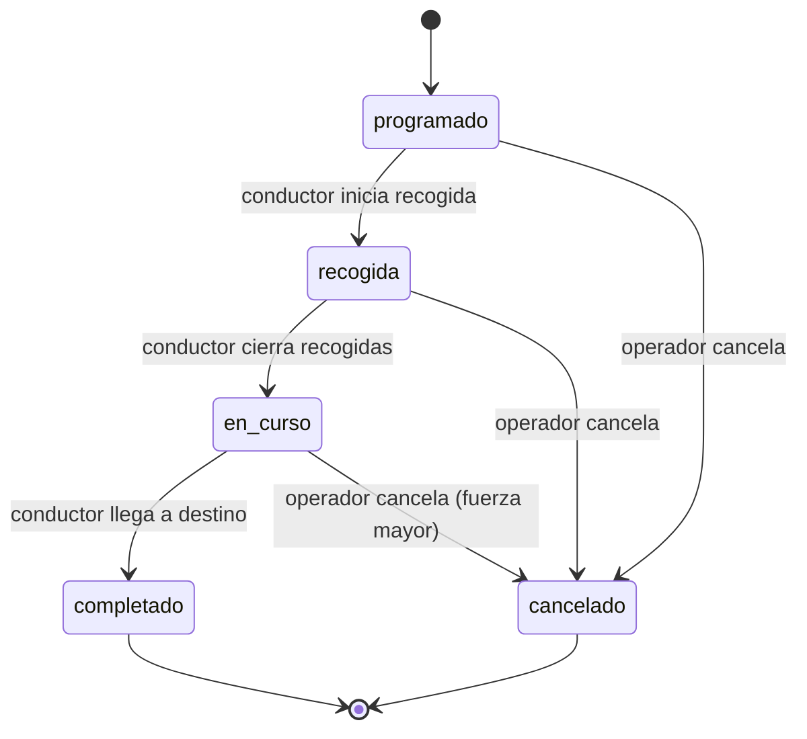
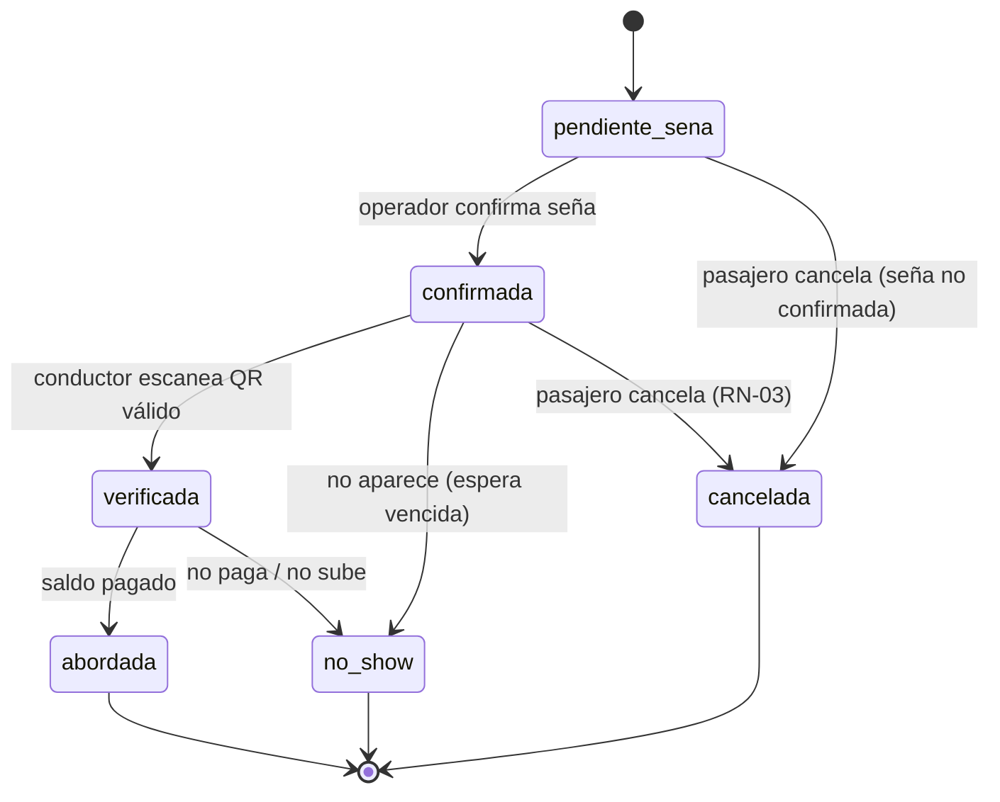
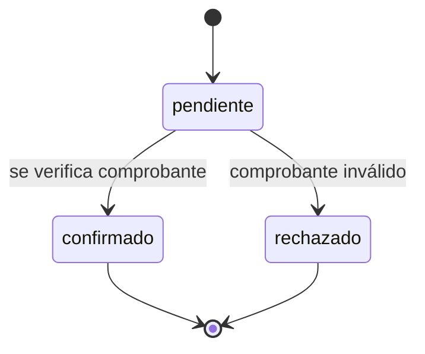

# Reglas y Estados — Plataforma de Viajes Compartidos Interurbanos

**Producto:** plataforma de viajes compartidos interurbanos (tramo principal Tandil ↔ Buenos Aires).
**Documento:** 06-reglas-y-estados.md · Especificación ejecutable de estados y reglas de negocio.
**Rol:** formaliza las máquinas de estado (AD-12) y las reglas de negocio (RN) como especificación directa para el dominio. Cada regla cita su setting (AD-5); **ningún valor de negocio va hardcodeado**.

---

## 1. Estados

Enums definidos en `04-modelo-de-datos.md`: `estado_viaje`, `estado_reserva`, `estado_pago`.

### 1.1 Viaje



| De | A | Quién | Guard | Efecto |
|---|---|---|---|---|
| programado | recogida | conductor del viaje | — | notifica salida |
| recogida | en_curso | conductor del viaje | todas las paradas resueltas (abordado / no_show) | notifica "en ruta" |
| en_curso | completado | conductor del viaje | llegada a destino | cierra viaje, registra fin |
| programado · recogida · en_curso | cancelado | operador | (fuerza mayor) | notifica y aplica devoluciones (RN-CANCEL) |

`completado` y `cancelado` son terminales. Cualquier transición no listada es `TRANSICION_INVALIDA`.

### 1.2 Reserva



| De | A | Quién | Guard | Efecto |
|---|---|---|---|---|
| (creación) | pendiente_sena | pasajero | hay capacidad (RN-CAPACIDAD) | genera `qr_token` opaco + snapshot `monto_sena` y `politica_cancelacion` |
| pendiente_sena | confirmada | operador | seña confirmada (pago `confirmado`) | asiento asegurado |
| pendiente_sena | cancelada | pasajero | — | sin devolución (la seña nunca se confirmó) |
| confirmada | verificada | conductor | QR válido server-side (AD-11) | — |
| verificada | abordada | conductor | saldo pagado | pasajero a bordo |
| confirmada · verificada | no_show | conductor | espera > `reserva.espera_max_min` y no apareció | seña retenida (0%) |
| confirmada | cancelada | pasajero | antelación según RN-03 | devolución según franja |
| (no terminal) | cancelada | operador | viaje cancelado | devolución 100% (RN-CANCEL) |

### 1.3 Pago



| De | A | Quién | Guard | Efecto |
|---|---|---|---|---|
| (creación) | pendiente | pasajero (seña) · conductor (saldo) | — | — |
| pendiente | confirmado | operador (seña) · conductor/operador (saldo) | comprobante verificado | si es seña → reserva pasa a `confirmada` |
| pendiente | rechazado | operador | comprobante inválido | — |

---

## 2. Reglas de negocio (en función de settings)

### RN-01 — Seña

- Monto: `reserva.sena_monto` (default `5000`).
- Método: **transferencia** (de `pagos.metodos`). El pasajero adjunta `comprobante`; el pago queda `pendiente` y la reserva `pendiente_sena`.
- La reserva **no** queda confirmada hasta RN-CONFIRMACION.

### RN-02 — Saldo al subir

- `saldo = viaje.precio − reserva.monto_sena` (la comisión la retiene la plataforma, no se descuenta al pasajero).
- Se paga al subir, en **efectivo** o **transferencia**. El conductor lo registra (`pago` tipo `saldo`).

### RN-03 — Devolución de seña por cancelación del pasajero

```
antelacion = viaje.fecha_salida − now
si antelacion > 24h            → devolución = monto_seña × reserva.devolucion_24h_pct / 100
si 12h ≤ antelacion ≤ 24h      → devolución = monto_seña × reserva.devolucion_12_24h_pct / 100
si antelacion < 12h            → devolución = monto_seña × reserva.devolucion_menos_12h_pct / 100  (= 0)
```

Defaults: `devolucion_24h_pct=100`, `devolucion_12_24h_pct=50`, `devolucion_menos_12h_pct=0`.

### RN-04 — Política de espera (no-show)

- Al llegar a una parada, el conductor espera `reserva.espera_max_min` (default `5`).
- Si el pasajero no aparece dentro de ese tiempo → la reserva pasa a `no_show`, seña retenida (0%). El viaje **continúa** (no se perjudica a quienes cumplieron el horario).

### RN-CAPACIDAD — Control de asientos

```
asientos_libres = vehiculo.capacidad − count(reservas del viaje con estado ∈ {pendiente_sena, confirmada, verificada, abordada})
si asientos_libres ≤ 0 → rechazar con RESERVA_SIN_ASIENTOS
```

`asiento_num` (opcional) debe estar en `1..capacidad` y no repetido entre reservas activas.

### RN-CONFIRMACION — Confirmación de seña (manual)

- `POST /pagos/{id}/confirmar` (operador) verifica el `comprobante` y marca el pago `confirmado`.
- Efecto: la reserva pasa `pendiente_sena → confirmada`. Recién ahí el asiento queda asegurado y el QR es utilizable.

### RN-VERIFICACION — QR al subir (AD-11)

- El conductor escanea `qr_token`; la validación es **server-side**: reserva debe pertenecer al **viaje**, al **conductor** y al **vehículo** de la sesión, y estar en `confirmada`.
- Respuestas: válido → `verificada`; de otro viaje → `QR_INVALIDO`; ya usada → `QR_YA_VERIFICADO`.

### RN-CANCEL — Cancelación por el operador

- Si el operador cancela un viaje, todas las reservas no terminales pasan a `cancelada` con **devolución del 100%** de la seña (independiente de la franja).

### RN-06 — Viaje con un solo pasajero

- Un viaje programado **se realiza igual** con un único pasajero reservado (pérdida asumida como costo inicial).

### RN-08 — Comisión

- La plataforma retiene `comision.plataforma_pct` (default `15`, rango 0–15) sobre `viaje.precio`. Cálculo y liquidación a conductores queda post-MVP.

### RN-09 — Precio

- `tarifa.modelo = "fijo_por_ruta"`. `viaje.precio` es snapshot de `tarifa.precio_base_tandil_bsas` al crear el viaje.

---

## 3. Casos límite (edge cases)

| Caso | Comportamiento |
|---|---|
| Seña nunca confirmada y el viaje sale | La reserva queda `pendiente_sena`; no sube nadie sin seña confirmada. Se cierra como `cancelada` al completar el viaje. |
| Pasajero cancela con la seña aún `pendiente_sena` | `cancelada`, sin devolución (nunca se confirmó el pago). |
| QR válido pero el pasajero no paga el saldo | `no_show` (espera vencida), seña retenida. |
| Dos reservas intentan el mismo `asiento_num` | La segunda se rechaza (`RESERVA_SIN_ASIENTOS` o asiento ocupado). |
| Conductor quiere pasar `recogida → en_curso` con paradas pendientes | No permitido: guard exige todas las paradas resueltas. |
| Operador cambia un setting a mitad del viaje | No afecta los snapshots ya tomados (precio, seña, política). |
| Re-sincronización de la cola offline | `client_id` único → no duplica (AD-7). |
| Transferencia rechazada por el operador | Pago `rechazado`; la reserva sigue `pendiente_sena`; el pasajero puede reenviar comprobante. |

---

## 4. Dónde vive cada cosa

| Regla / máquina | Vive en | Settings que usa |
|---|---|---|
| Máquina de estados de viaje | `features/viajes/domain` | — |
| Máquina de estados de reserva | `features/reservas/domain` | — |
| Máquina de estados de pago | `features/pagos/domain` | — |
| RN-01/RN-02/RN-03 | `features/reservas/domain` | `reserva.*` |
| RN-04 (espera) | `features/viajes/application` | `reserva.espera_max_min` |
| RN-CAPACIDAD | `features/reservas/application` | — (capacidad en `vehiculo`) |
| RN-CONFIRMACION / RN-VERIFICACION | `features/pagos` / `features/reservas` | `pagos.metodos` |
| RN-08 / RN-09 | `features/viajes/domain` | `comision.plataforma_pct`, `tarifa.*` |
